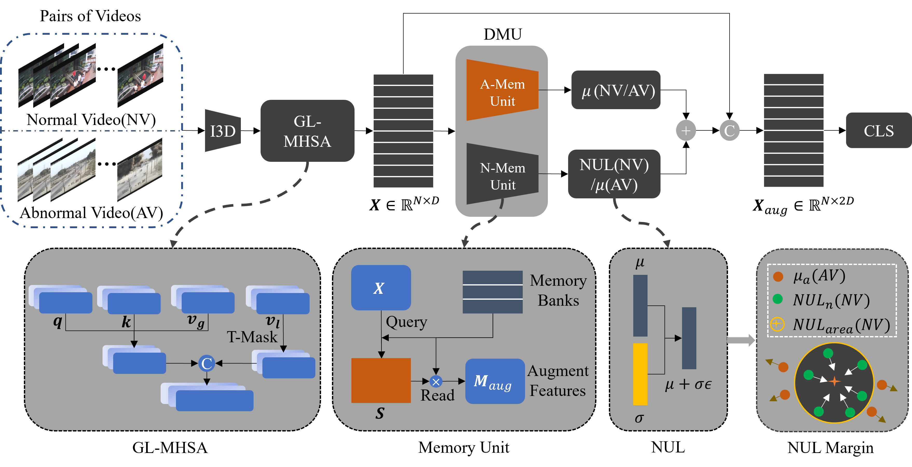

# UR-DMU
This repo contains the Pytorch implementation of our paper:
> **Dual Memory Units with Uncertainty Regulation for Weakly Supervised Video Anomaly Detection**
> 
> Hang Zhou, Junqing Yu, Wei Yang
- **Accepted at AAAI 2023.**  



## Training

### Setup
**We use the extracted I3D features for UCF-Crime and XD-Violence datasets from the following works:**
> [**UCF-Crime 10-crop I3D features**](https://github.com/Roc-Ng/DeepMIL)
> 
> [**XD-Violence 5-crop I3D features**](https://roc-ng.github.io/XD-Violence/)
> 
> [**best performance ckpt for UCF**](models/ucf_trans_2022.pkl)
>
> [**best performance ckpt for XD**](models/xd_trans_2022.pkl)

You can also use the I3D model to extract features from [**preprocess**](feature_extract/README.md).

The following files need to be adapted in order to run the code on your own machine:
- Change the file paths to the download datasets above in `list/XD_Train.list` and `list/XD_Test.list`. 
- Feel free to change the hyperparameters in `option.py`
### Train and test the UR-DMU
After the setup, simply run the following command: 

start the visdom for visualizing the training phase

```
python -m visdom.server -p "port"(we use 2022)
```
Traing and infer for XD dataset
```
python xd_main.py
python xd_infer.py
```
Traing and infer for UCFC dataset
```
python ucf_main.py
python ucf_infer.py
```

## References
We referenced the repos below for the code.

* [RTFM](https://github.com/tianyu0207/RTFM)
* [XDVioDet](https://github.com/Roc-Ng/XDVioDet)

## Citation

If you find this repo useful for your research, please consider citing our paper:

```bibtex
@article{URDMU_zh,
  title={Dual Memory Units with Uncertainty Regulation for Weakly Supervised Video Anomaly Detection},
  author={Zhou, Hang and Yu, Junqing and Yang, Wei},
  booktitle = {Proceedings of the AAAI Conference on Artificial Intelligence (AAAI)},
  year={2023}
}
```
---
